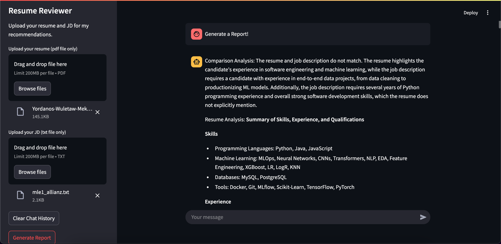

# Resume Analyzer AI

## Overview
Resume Analyzer AI is a tool designed to assess how effectively resumes match job descriptions using Gemini language models and Azure's cloud infrastructure. The system allows users to upload job descriptions and resumes, generate embeddings for both, and calculate similarity scores using cosine similarity. Additionally, it analyzes resumes against job descriptions to highlight areas for improvement and provides actionable suggestions such as relevant skills, action words, and formatting tips. The application is deployed on Azure for scalability and accessibility.

## Features
- **Text Parsing:** Extracts text from resumes and job descriptions using PDF/Text parsers.
- **Embedding Generation:** Generates embeddings using pre-trained models like VertexAIEmbeddings.
- **Similarity Calculation:** Computes cosine similarity scores between resumes and job descriptions.
- **Gap Analysis:** Identifies key missing skills and experience gaps.
- **Personalized Suggestions:** Uses LLMs to provide improvement recommendations.
- **User Interface:** Built with Streamlit to provide an intuitive user experience.
- **Feedback Mechanism:** Allows users to rate suggestions for continuous improvement.

## Approach
1. **Data Parsing and Preparation**
   - Extract text from resumes and job descriptions using parsers.
   - Preprocess text data to remove irrelevant information and standardize formatting.

2. **Embedding Generation**
   - Generate embeddings for resumes and job descriptions.
   - Ensure embeddings capture semantic meaning for accurate matching.

3. **Similarity Calculation**
   - Use cosine similarity to compute similarity scores.
   - Rank resumes based on scores to identify best matches.

4. **Gap Analysis**
   - Analyze differences between resumes and job descriptions.
   - Identify missing skills or irrelevant experience.

5. **Suggestions Generation**
   - Provide personalized improvement suggestions using LLMs.
   - Offer relevant skills, action words, and formatting tips.

6. **User Interface Development**
   - Develop a frontend using Streamlit.
   - Display similarity scores, gap analysis, and improvement suggestions.

7. **Feedback Loop and Continuous Improvement**
   - Implement a user feedback system.
   - Refine prompts and improve suggestions over time.
8. **Deployment**
   - Deploy the application on Azure using Azure App Service. 
   - Ensure scalability and accessibility for users, allowing them to assess and improve their resumes efficiently.

## Prerequisites
- Python 3.11
- [Poetry](https://python-poetry.org/)
- [GNU Make](https://www.gnu.org/software/make/)

## Setup Instructions
1. Clone the repository:
   ```bash
   git clone https://github.com/yordanoswuletaw/resume-analyzer.git
   cd resume-analyzer
   ```
2. Initialize and install dependencies using GNU Make and Poetry:
   ```bash
   make init
   make install
   ```
3. Run the application:
   ```bash
   make run-model
   ```

## Folder Structure
```
resume-analyzer/
│-- data/
│-- notebooks/
│   │-- resume-rag.ipynb
│   │-- resume-scorer.ipynb
│-- output/
│-- src/
│   │-- utils/
│   │   │-- __init__.py
│   │   │-- config.py
│   │   │-- logger.py
│   │   │-- embedding_model.py
│   │   │-- file_reader.py
│   │   │-- main.py
│   │   │-- resume_scorer.py
│-- .env
│-- .gitignore
│-- Makefile
│-- poetry.lock
│-- pyproject.toml
│-- README.md
```
## Sample Output

Below are sample outputs from the Resume Analyzer AI:
 

## License
This project is licensed under the MIT License.

## Contributing
Contributions are welcome! Please submit issues or pull requests to improve the project.
